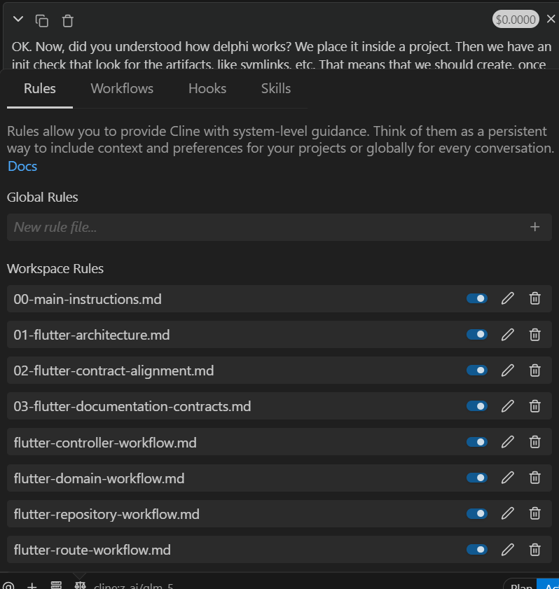

rid o# Cline Artifacts Manifest

This document tracks all transformed artifacts from the Delphi AI Co-Engineer skills repository.

## Transformation Status - COMPLETE ✅

### Rules (`.clinerules/`)

| File | Status |
|------|--------|
| `00-main-instructions.md` | ✅ Complete |
| `01-flutter-architecture.md` | ✅ Complete |
| `02-flutter-contract-alignment.md` | ✅ Complete |
| `03-flutter-documentation-contracts.md` | ✅ Complete |
| `glob/flutter-controller-workflow.md` | ✅ Complete |
| `glob/flutter-domain-workflow.md` | ✅ Complete |
| `glob/flutter-repository-workflow.md` | ✅ Complete |
| `glob/flutter-route-workflow.md` | ✅ Complete |
| `glob/flutter-screen-workflow.md` | ✅ Complete |
| `model-decision/docker-architecture-mode-transition.md` | ✅ Complete |
| `model-decision/docker-ci-pipeline.md` | ✅ Complete |
| `model-decision/docker-runtime-ingress.md` | ✅ Complete |
| `model-decision/shared-foundation-docs-sync.md` | ✅ Complete |
| `model-decision/shared-initialization-readiness.md` | ✅ Complete |
| `model-decision/shared-realtime-delta-streams.md` | ✅ Complete |
| `model-decision/shared-session-lifecycle.md` | ✅ Complete |
| `model-decision/shared-todo-driven-execution.md` | ✅ Complete |
| `model-decision/shared-workflow-definition.md` | ✅ Complete |
| `manual/shared-self-improvement.md` | ✅ Complete |

### Skills (`.cline/skills/`)

| File | Status |
|------|--------|
| `flutter-architecture-adherence.md` | ✅ Complete |
| `flutter-smell-async-navigation.md` | ✅ Complete |
| `flutter-smell-mounted-checks.md` | ✅ Complete |
| `flutter-smell-build-side-effects.md` | ✅ Complete |
| `flutter-widget-local-state-heuristics.md` | ✅ Complete |
| `flutter-smell-layout-hotspots.md` | ✅ Complete |
| `flutter-smell-list-performance.md` | ✅ Complete |
| `flutter-smell-image-media.md` | ✅ Complete |
| `flutter-performance-smell-scanner.md` | ✅ Complete |

### Workflows (`.cline/workflows/`)

| File | Status |
|------|--------|
| `create-controller.md` | ✅ Complete |
| `create-domain.md` | ✅ Complete |
| `create-screen.md` | ✅ Complete |
| `create-repository.md` | ✅ Complete |
| `create-route.md` | ✅ Complete |
| `docker-session-lifecycle.md` | ✅ Complete |
| `docker-post-session-review.md` | ✅ Complete |
| `docker-self-improvement-session.md` | ✅ Complete |
| `docker-todo-driven-execution.md` | ✅ Complete |
| `docker-environment-readiness.md` | ✅ Complete |
| `docker-persona-selection.md` | ✅ Complete |
| `docker-realtime-delta-streams.md` | ✅ Complete |
| `docker-architecture-mode-transition.md` | ✅ Complete |
| `docker-update-ci-pipeline.md` | ✅ Complete |
| `docker-update-runtime-and-ingress.md` | ✅ Complete |
| `docker-documentation-migration.md` | ✅ Complete |
| `laravel-create-api-endpoint.md` | ✅ Complete |
| `laravel-create-domain.md` | ✅ Complete |
| `laravel-domain-resolution-testing.md` | ✅ Complete |
| `laravel-tenant-access-guardrails.md` | ✅ Complete |

### Hooks (`.cline/hooks/`)

**Lifecycle Hooks:**
| File | Status |
|------|--------|
| `pre_tool_use` | ✅ Complete |
| `post_tool_use` | ✅ Complete |
| `session_start` | ✅ Complete |
| `session_end` | ✅ Complete |

**Flutter Path-Based Hooks:**
| File | Glob Pattern | Status |
|------|--------------|--------|
| `flutter_controller` | `flutter-app/lib/presentation/**/controllers/**` | ✅ Complete |
| `flutter_screen` | `flutter-app/lib/presentation/**/screens/**` | ✅ Complete |
| `flutter_domain` | `flutter-app/lib/domain/**` | ✅ Complete |
| `flutter_repository` | `flutter-app/lib/infrastructure/repositories/**` | ✅ Complete |
| `flutter_route` | `flutter-app/lib/**/routes/**` | ✅ Complete |

**Docker Path-Based Hooks:**
| File | Glob Pattern | Status |
|------|--------------|--------|
| `docker_ci_pipeline` | `**/.github/workflows/**, **/docker-compose*.yml, **/Dockerfile*` | ✅ Complete |
| `docker_runtime_ingress` | `docker/**, docker-compose.yml, **/nginx/**` | ✅ Complete |

**Laravel Path-Based Hooks:**
| File | Glob Pattern | Status |
|------|--------------|--------|
| `laravel_model` | `laravel-app/app/Models/**` | ✅ Complete |
| `laravel_route` | `laravel-app/routes/**` | ✅ Complete |
| `laravel_test` | `laravel-app/tests/**` | ✅ Complete |

**Documentation Hooks:**
| File | Glob Pattern | Status |
|------|--------------|--------|
| `foundation_docs` | `foundation_documentation/**` | ✅ Complete |

### Infrastructure

| File | Status |
|------|--------|
| `CLINE.md` (bootloader) | ✅ Complete |
| `.cline/MANIFEST.md` | ✅ Complete |

---

## Summary

| Category | Count |
|----------|-------|
| Rules | 19 |
| Skills | 9 |
| Workflows | 20 |
| Hooks (Lifecycle) | 4 |
| Hooks (Flutter) | 5 |
| Hooks (Docker) | 2 |
| Hooks (Laravel) | 3 |
| Hooks (Documentation) | 1 |
| Infrastructure | 2 |
| **Total** | **65** |

## Source Skills Transformed

The following source skill directories were transformed:

### Flutter Skills
- `skills/flutter-architecture-adherence/`
- `skills/flutter-performance-smell-scanner/`
- `skills/flutter-smell-async-navigation/`
- `skills/flutter-smell-build-side-effects/`
- `skills/flutter-smell-image-media/`
- `skills/flutter-smell-layout-hotspots/`
- `skills/flutter-smell-list-performance/`
- `skills/flutter-smell-mounted-checks/`
- `skills/flutter-widget-local-state-heuristics/`

### Flutter Workflows
- `skills/wf-flutter-create-controller-method/`
- `skills/wf-flutter-create-domain-method/`
- `skills/wf-flutter-create-repository-method/`
- `skills/wf-flutter-create-route-method/`
- `skills/wf-flutter-create-screen-method/`

### Docker Workflows
- `skills/wf-docker-architecture-mode-transition-method/`
- `skills/wf-docker-documentation-migration-method/`
- `skills/wf-docker-environment-readiness-method/`
- `skills/wf-docker-persona-selection-method/`
- `skills/wf-docker-post-session-review-method/`
- `skills/wf-docker-realtime-delta-streams-method/`
- `skills/wf-docker-self-improvement-session-method/`
- `skills/wf-docker-session-lifecycle-method/`
- `skills/wf-docker-todo-driven-execution-method/`
- `skills/wf-docker-update-ci-pipeline-method/`
- `skills/wf-docker-update-runtime-and-ingress-method/`

### Laravel Workflows
- `skills/wf-laravel-create-api-endpoint-method/`
- `skills/wf-laravel-create-domain-method/`
- `skills/wf-laravel-domain-resolution-testing/`
- `skills/wf-laravel-tenant-access-guardrails/`

### Rules
- `skills/rule-flutter-flutter-contract-alignment-always-on/`
- `skills/rule-flutter-flutter-documentation-contracts-always-on/`
- `skills/rule-flutter-flutter-controller-workflow-glob/`
- `skills/rule-flutter-flutter-domain-workflow-glob/`
- `skills/rule-flutter-flutter-repository-workflow-glob/`
- `skills/rule-flutter-flutter-route-workflow-glob/`
- `skills/rule-flutter-flutter-screen-workflow-glob/`
- `skills/rule-docker-docker-architecture-mode-transition-model-decision/`
- `skills/rule-docker-docker-ci-pipeline-model-decision/`
- `skills/rule-docker-docker-runtime-ingress-model-decision/`
- `skills/rule-docker-shared-foundation-docs-sync-model-decision/`
- `skills/rule-docker-shared-initialization-readiness-model-decision/`
- `skills/rule-docker-shared-realtime-delta-streams-model-decision/`
- `skills/rule-docker-shared-session-lifecycle-model-decision/`
- `skills/rule-docker-shared-todo-driven-execution-model-decision/`
- `skills/rule-docker-shared-workflow-definition-model-decision/`
- `skills/rule-docker-shared-self-improvement-manual/`

---

## Transformation Complete

All artifacts from the Delphi AI Co-Engineer skills repository have been successfully transformed to Cline-compatible format.

**Transformation Date:** 2026-02-20